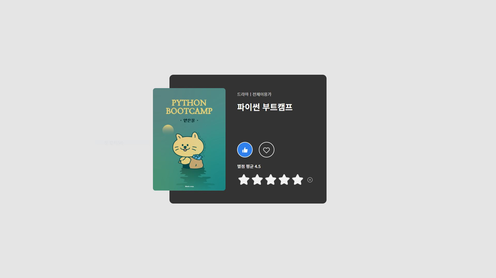
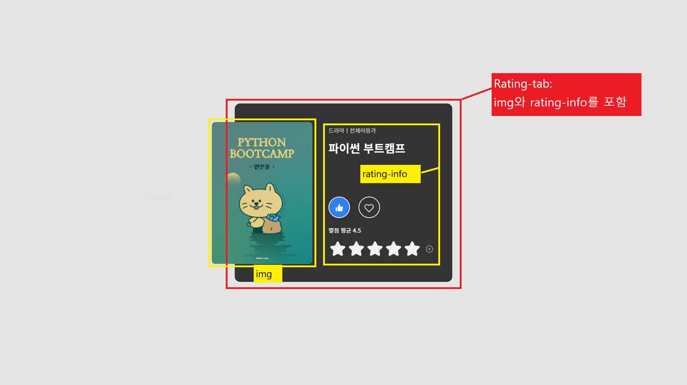
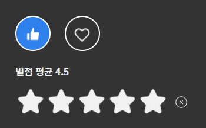

# **레이아웃 구현 프로젝트 - 2**  
## HTML과 CSS만을 이용한 별점 동적 구현  
  
### markup 작성법  
semantic한 markup 작성을 위해 div, span 사용을 지양하였고 각 box에 알맞게 태그를 사용.  
  
- img element를 rating-tab의 자식요소로 포함, position absolute를 이용해 바깥으로 벗어나도록 style.  
- rating-info 역시 position absolute를 이용해 위치 조정.  
- ul > li 를 이용한 장르, 연령 고지 정보 전달.  
- 별점 정보 제목에 해당하는 영역은 strong, em, h3 등에서 고민하다가 rating-info 영역의 제목에 해당한다고 판단, h3 부여.  
- rating action이 일어나는 rating-form 상단 현재 평균 별점 정보를 제공하는 rating-avg 요소는 fieldset의 legend에 해당하지 않는다고 판단, 긴급한 정보도 아니라 판단, strong이 아닌 em으로만 강조.  
- 0.5단위의 별점을 위해 rating action 영역은 10칸으로 구분.  
- 별점 reset 버튼 역시 img로 style.  

### css 작성법  
- chckbx와 rating-form 영역 input은 모두 label을 이용해 style.
- 마우스 hover시 반응하도록 css 작성  
- chckbx는 향후 js 적용을 위해 class에 on이 들어갈 경우 버튼 활성화.  

### 향후 개선이 필요한 부분  
- 별점 클릭시 활성 별점 고정 필요.  
- reset 버튼 활성화 필요.
